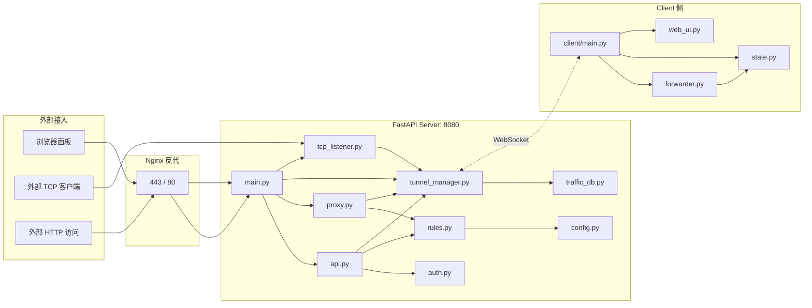

# easy_vpn 代码审查报告

**审查时间：** 2026-04-24
**审查范围：** Server (Python / FastAPI) · Client (Python / websockets) · Dashboard (Vue 3 / Vite) · 部署脚本与 Docker 配置
**审查方式：** 静态代码审阅（只读）+ 架构交叉校验
**代码规模：** 约 3337 行（后端 1263 · 客户端 1163 · 前端 911）
**严重度定义：** P0 阻断风险 · P1 高风险 · P2 中风险 · P3 低风险 / 体验改进

> 本报告不包含可直接合入的修复代码，仅列出问题定位与修复思路，供团队后续决策。

---

## 1. 摘要

easy_vpn 是一个职责清晰、功能完整、文档质量高的轻量内网穿透实现。整体架构（单 WebSocket + channel_id 多路复用 + 面板/隧道域名分流）设计合理，性能报告也证明其在生产流量下资源占用极低（45 MB 内存、50 并发 100% 成功）。代码量小（<3500 行）便于维护，且已有完善的日志轮转、心跳检测、热重载等基础能力。

**但在安全与并发健壮性上仍有若干值得关注的短板，主要集中在认证链路（明文口令 + 时序攻击 + 无限流）、共享鉴权 token 的长生命周期、以及 TunnelManager 的并发字典访问。前端侧 JWT 存 localStorage 的做法也与 SPA 常见风险点一致。** 此外项目零自动化测试、`TunnelManager` / `Dashboard.vue` 单文件过大，是工程化层面的两个主要欠账。

### Top 5 风险（按落地价值排序）

| # | 严重度 | 摘要 | 位置 |
|---|:---:|------|------|
| 1 | **P0** | 管理员口令与 Client token 采用 `==` 明文比较且无登录限流，存在时序攻击与暴力破解面 | [server/auth.py:24-29](server/auth.py), [server/api.py:20-25](server/api.py) |
| 2 | **P1** | `TunnelManager` 多处字典在 `await` 前后不持锁读写，`heartbeat_loop` 调用 `disconnect` 时未带 websocket 参数可能误杀刚重连的新连接 | [server/tunnel_manager.py](server/tunnel_manager.py) |
| 3 | **P1** | Client token 为长期共享秘钥，JWT 存 `localStorage` 易受 XSS 窃取，面板无刷新 token 策略；`python-jose` 历史上有 CVE | [server/auth.py](server/auth.py), [dashboard/src/stores/auth.js:15](dashboard/src/stores/auth.js), [server/requirements.txt](server/requirements.txt) |
| 4 | **P1** | 规则 JSON 非原子写入（`open('w')`+`json.dump`），崩溃可能导致 `rules.json` 截断丢失全部规则 | [server/rules.py:125-128](server/rules.py) |
| 5 | **P1** | 项目零自动化测试，协议双份维护（server/client 各一份）带来的漂移风险无兜底保障 | 全局 · [server/protocol.py](server/protocol.py) vs [client/protocol.py](client/protocol.py) |

---

## 2. 整体评估

| 维度 | 评级 | 说明 |
|------|:---:|------|
| 架构与设计 | ★★★★☆ | 单 WS 多路复用合理；`TunnelManager` 过胖、协议双份维护是主要瑕疵 |
| 安全 | ★★☆☆☆ | 明文口令比较、无限流、token 生命周期长、JWT 存 localStorage，多处可硬化 |
| 异步/并发 | ★★★☆☆ | 大部分路径正确，但字典访问与心跳 disconnect 存在可观察的竞态 |
| 代码质量 | ★★★☆☆ | 命名规范、日志齐全；Dashboard.vue / web_ui.py 单文件过大；缺类型/校验层 |
| 可维护性 | ★★★☆☆ | 文档详实但三份高度重叠；零测试；无 CI |
| 部署与运维 | ★★★★☆ | 一键脚本幂等、友好；缺 HEALTHCHECK，容器以 root 运行 |
| **综合** | **★★★☆☆** | **工程成熟度中等偏上，生产可用，但安全与测试需补课** |

---

## 3. 架构分析

### 3.1 模块依赖图

### 3.2 核心数据流

- **HTTP 隧道**：`外部 → Nginx → catch_all → proxy_handler → TunnelManager.forward_http → WS → Client.forward_http → 本地服务`
- **TCP 隧道**：`外部 → TcpListener → open_tcp_channel → WS → Client.open_tcp → 本地服务`
- **规则下发**：面板 CRUD → `rules_manager` 落盘 → `tunnel_manager.push_rules()` 实时推送
- **心跳**：Server 每 30s 主动发 HEARTBEAT，Client 回 ACK 更新 `last_heartbeat`；超过 90s 判离线

### 3.3 主要设计优点

1. 单 WebSocket + channel_id 多路复用，避免了频繁建连开销
2. Future（HTTP）与 Queue（TCP）语义清晰，分别契合"请求-响应"和"流"两种模式
3. 规则变更即时下发，无需重启任何一端，生产上非常省心
4. 域名分流（`panel_host` 独占 SPA，其余 `Host` 走隧道）模型简单、可扩展
5. 日志轮转 + 过期清理 + 总量上限 在 Server/Client 两端对齐，是常见坑里的高分实现
6. 部署脚本对 Nginx 配置做了预校验、自动备份、失败回滚，工业级水准

---

## 4. 详细发现

> 格式：`[严重度] 标题 — 位置 — 现象 — 影响 — 修复思路`

### 4.1 架构与设计

#### A1 [P1] 协议定义双端重复
- **位置**：[server/protocol.py](server/protocol.py) 与 [client/protocol.py](client/protocol.py)（两文件内容完全一致，经 `diff` 确认）
- **现象**：`MsgType` 枚举、`encode/decode/decode_data/new_channel_id` 在两端各拷贝一份。任何协议演进（新增消息类型、字段变更）都必须同步两处；一旦遗漏则 dispatch 静默走到 `else` 不进任何分支。
- **影响**：日积月累出现漂移 bug 的概率非常高；目前靠纪律而非机制约束。
- **修复思路**：抽到共享包（例如根目录 `protocol/`），Server 和 Client 的 `requirements` 或 `PYTHONPATH` 各自引用；或保留文件镜像，但在 CI 中加一条 `diff server/protocol.py client/protocol.py` 守门。

#### A2 [P2] `TunnelManager` 单类承担太多职责
- **位置**：[server/tunnel_manager.py](server/tunnel_manager.py)（311 行）
- **现象**：一个类同时负责 WebSocket 连接簿记、HTTP channel Future 表、TCP channel Queue 表、规则推送、心跳循环、流量统计与 DB flush。
- **影响**：测试难以单元化（没法只测心跳而不启动整个通道体系）；新增能力（例如连接级限流）找不到自然挂载点。
- **修复思路**：按"连接登记簿 / HTTP 通道 / TCP 通道 / 流量统计"拆 4 个子模块，`TunnelManager` 收缩为门面（Facade）。流量统计可独立成 `TrafficRecorder`，被注入。

#### A3 [P2] 函数内 `from X import Y` 的循环依赖绕法
- **位置**：[server/main.py:122](server/main.py)（`from traffic_db import init_db`）、[server/main.py:218](server/main.py)（`from proxy import proxy_handler`）、[server/tunnel_manager.py:42, 117, 134](server/tunnel_manager.py)（`from rules import rules_manager`, `from traffic_db import ...`）
- **现象**：多处使用函数内局部 import，实质是为了绕过模块级循环依赖。
- **影响**：依赖关系隐式化，静态分析工具和 IDE 难以识别；冷启动时 import 次数增加。
- **修复思路**：引入依赖注入（构造函数接收 `rules_manager`、`traffic_db` 函数引用），或把循环一方抽成接口。

#### A4 [P2] `Host` 头是面板/隧道分流的唯一依据
- **位置**：[server/main.py:198-219](server/main.py)
- **现象**：`catch_all` 只依赖 `Host` 头判断路由目的地；`localhost`/`127.0.0.1` 也被放到面板分支。
- **影响**：若 Nginx 配置失误或反代层被绕过（如直接请求容器 8080，尤其在同宿主多容器场景），恶意 `Host` 头可能命中任意子域名的隧道。当前通过 `127.0.0.1:8080` 绑定缓解了外网直连，但非纵深防御。
- **修复思路**：在 Nginx 层强制 `proxy_set_header Host $host` 并拒绝未知 `Host`；或在 FastAPI 中白名单化合法 `Host`；至少记录异常 `Host` 日志以便取证。

#### A5 [P2] HTTP 请求体/响应体全量缓冲
- **位置**：[server/proxy.py:27, 40, 50](server/proxy.py)、[client/forwarder.py:30, 42, 52](client/forwarder.py)
- **现象**：`body = await request.body()` 一次性读完；`body.decode("latin-1")` 放进 JSON；响应同样一次读完再编码。
- **影响**：对于文件上传、大附件、长轮询或 SSE，会爆内存或被 30s 超时卡死。latin-1 是字节安全映射，功能正确，但延迟不友好。
- **修复思路**：HTTP 隧道不是核心性能路径时可接受；如需长期支持大流量/流式，改走 TCP 隧道通道（chunked transfer），或在 WS 消息上引入分片（multi-frame channel）。

#### A6 [P3] TCP 端口范围在 `config.py` 和 `docker-compose.yml` 双份硬编码
- **位置**：[server/config.py:22-23](server/config.py) `tcp_port_min=2200, tcp_port_max=2299` vs [docker-compose.yml:11](docker-compose.yml) `0.0.0.0:2200-2299:2200-2299`
- **现象**：改 `.env` 的端口段不会同步 compose 暴露范围。
- **修复思路**：至少在 README/CLAUDE.md 里加"双改"提醒；或通过 `.env` 变量 + compose 的 `${TCP_PORT_MIN}` 模板统一。

---

### 4.2 安全

#### S1 [P0] 管理员口令明文存储 + `==` 比较，且无登录限流
- **位置**：[server/auth.py:24-25](server/auth.py)、[server/api.py:20-25](server/api.py)、[.env.example:9](.env.example)
- **现象**：
  1. `ADMIN_PASSWORD` 以明文写在 `.env`，服务进程内存中也以明文驻留
  2. 校验时直接 `username == ... and password == ...`，字符串 `==` 非恒定时间，理论上存在时序旁路
  3. `/api/auth/login` 无任何频率限制，可被持续暴力撞库
  4. 依赖里已经装了 `passlib[bcrypt]==1.7.4` 但全项目未使用
- **影响**：任何能访问面板的攻击者都能做离线/在线字典攻击；管理员口令一旦泄露等同于完全沦陷。
- **修复思路**：
  - 引入 `passlib.hash.bcrypt`（或现代的 `argon2-cffi`）对口令做哈希后存放（环境变量放 hash，或首次运行生成 `admin.pwd` 文件）
  - 比较改用 `secrets.compare_digest(...)` 做恒定时间比较
  - 在登录路由接入限流：可用 `slowapi`、`fastapi-limiter`（需 Redis）或自实现基于 IP/用户名的令牌桶，错误超过 N 次则短暂锁定
  - 登录失败日志中 **不要** 打印原始口令

#### S2 [P1] Client token 与 UI 口令同样用 `==` 比较
- **位置**：[server/auth.py:28-29](server/auth.py) `verify_client_token`；[client/web_ui.py:483](client/web_ui.py) `body.get("password") != client_state.ui_password`
- **现象**：同 S1，都是明文加 `==`。Client token 还是长期共享秘钥，无过期、无轮换。
- **影响**：一旦任意 Client 侧泄露 token（日志、容器镜像、备份），所有设备可被冒名注册；且无法吊销单个设备。
- **修复思路**：
  - 改用 `secrets.compare_digest`
  - 中长期：将共享 token 改为"每台设备一把的 pre-shared key"+ 设备白名单，吊销粒度细化
  - Client 本地 UI 口令 `ui_password` 目前会被写入容器日志（见 [client/web_ui.py:595-600](client/web_ui.py)），宜改为"仅首次/按需 `docker logs --tail` 提示一次"或落盘到 `/config/ui_password` 并提示用户自取

#### S3 [P1] JWT 存 `localStorage` + 单一长 token 无刷新机制
- **位置**：[dashboard/src/stores/auth.js:15](dashboard/src/stores/auth.js)、[server/auth.py:10-14](server/auth.py)、[server/config.py:11](server/config.py) `token_expire_minutes: int = 60 * 24`
- **现象**：前端通过 `localStorage.setItem('token', ...)` 保存 JWT；token 一次签发有效 24 小时；无 refresh token、无服务端黑名单。
- **影响**：任何能注入 JS 的 XSS（例如规则 `label` 字段未转义、或 Vue 组件的 `v-html` 扩展）都可窃取 token；泄露后 24h 内无法吊销。
- **修复思路**：
  - 将 token 放在 `HttpOnly; Secure; SameSite=Strict` Cookie 中（配合 CSRF token 或 SameSite=Strict 已足够个人面板）
  - 或维持 localStorage 但大幅缩短 token TTL（如 30 分钟）+ 引入 refresh token + 服务端可吊销列表
  - 同步：前端 401 拦截器里不要 `window.location.href = '/login'` 无差别跳，避免在非登录页无限循环

#### S4 [P1] `python-jose` 版本历史 CVE 风险
- **位置**：[server/requirements.txt:4](server/requirements.txt) `python-jose[cryptography]==3.5.0`
- **现象**：`python-jose` 3.3.0 及以下存在 CVE-2024-33663（algorithm confusion）与 CVE-2024-33664（JWE zip-bomb DoS）。3.5.0 已修复，但该库长期维护活跃度偏低，社区也在建议切换到 `pyjwt` / `authlib`。
- **影响**：长期风险。当前 `auth.py` 显式限定 `algorithms=["HS256"]`，已一定程度避免算法混淆，但应保持版本警觉。
- **修复思路**：把依赖更新机制化（Renovate / Dependabot）；中期考虑迁移到 `pyjwt`（API 几乎一致、维护更积极）。

#### S5 [P1] 登录/配置修改接口缺失审计日志
- **位置**：[server/api.py](server/api.py) 全局、[client/web_ui.py:549](client/web_ui.py)
- **现象**：登录成功/失败无日志；规则 CRUD 只记录 `rule added/updated/deleted`，但未记录操作者 IP / user / User-Agent。Client 修改 `config.yml` 时 token 会被落盘且日志未记录。
- **影响**：发生安全事件时无法回溯；无法判断是否曾被爆破。
- **修复思路**：在 `login` 里 `logger.warning("login failed from ip=%s user=%s", request.client.host, username)`；规则变更日志带上 JWT `sub`。

#### S6 [P1] HTTP 隧道透传敏感头，无 per-rule ACL
- **位置**：[server/proxy.py:30-33](server/proxy.py)
- **现象**：仅过滤 hop-by-hop header，`Authorization`、`Cookie`、`X-Forwarded-For` 等全部原样转发给 Client。
- **影响**：隧道出口（Client 所在设备）上的本地服务会看到外部原始 Cookie/Authorization，属于"把公网流量投递到内网"的正常行为，但缺少 per-rule ACL（白名单 IP、基础 Basic Auth）降低暴露面。
- **修复思路**：在 rule schema 里增加 `allow_ips`、`basic_auth`（上游 Nginx 配合或 Server 侧实现），并在 Dashboard UI 显式勾选启用。

#### S7 [P1] `catch_all` SPA 回退路径"有扩展名则 404"的过滤不完全
- **位置**：[server/main.py:211-214](server/main.py)
- **现象**：当前用 `path_obj.suffix` 过滤掉带扩展名的探测路径（如 `.php`、`.env`），是个聪明的反扫描保护。但路径 `wp-admin/setup-config` 这类无扩展名的扫描请求会命中 SPA fallback，返回 200 + `index.html`。
- **影响**：可能被识别为"存在 WordPress"，引来更多扫描；磁盘 I/O 成本不高但告警噪音大。
- **修复思路**：维护一个 SPA 有效路由白名单（`/`, `/login`, 加前端 router 列表），白名单外一律 404。也可在 Nginx 层做。

#### S8 [P2] Client 侧 `config.yml` 写回时无文件权限收敛
- **位置**：[client/web_ui.py:560-561](client/web_ui.py)
- **现象**：`open(path, 'w')` 未显式设置 mode，受 umask 影响通常为 0644；写入内容含明文 `token`。
- **影响**：多用户机器上其他用户可读；Docker 内影响较小。
- **修复思路**：写入前 `os.umask(0o077)` 或写完 `os.chmod(path, 0o600)`。

#### S9 [P2] 默认开发账号在 README 明文
- **位置**：[README.md:316](README.md) `默认账号：admin / admin123`
- **现象**：README 展示了默认开发账号，`dev.sh` 不强制用户修改 `.env`。
- **影响**：仅影响本地开发环境；但 `.env.example:9` 也写了 `ADMIN_PASSWORD=change-me` 占位，`config.py` 没有加载时的"占位值检测"。
- **修复思路**：在 `config.py` 的 `Settings` 中加 validator：若 `admin_password == "change-me"` 且 `HOST != "127.0.0.1"`，拒绝启动（服务端部署脚本已做此检查，但应用内也兜底）。

#### S10 [P2] WebSocket 无 Origin 校验
- **位置**：[server/main.py:154](server/main.py)
- **现象**：`/tunnel/ws` 只在首个 register 消息里校验 token，未校验 WS `Origin`。
- **影响**：浏览器端伪造的 WebSocket 连接可到达握手阶段；由于 token 校验在后，实际危害有限，但多一层 Origin 白名单是纵深防御。
- **修复思路**：FastAPI 侧检查 `websocket.headers.get("origin")`，白名单外直接拒绝。

#### S11 [P2] 缺失常规安全响应头
- **位置**：FastAPI 全局 / [server_deploy.sh:157-196](server_deploy.sh)
- **现象**：`Content-Security-Policy`、`X-Frame-Options`、`Referrer-Policy`、`HSTS` 等未显式下发；certbot 生成的 `options-ssl-nginx.conf` 默认也不含 CSP。
- **影响**：Dashboard 被嵌入 iframe 或遭遇 XSS 时，缓解能力不足。
- **修复思路**：在 Nginx 正式环境里补一段 `add_header` 配置；或在 FastAPI 通过中间件统一注入。

---

### 4.3 异步与并发

#### C1 [P1] `TunnelManager` 通道字典未统一加锁
- **位置**：[server/tunnel_manager.py](server/tunnel_manager.py) `_http_channels`, `_tcp_queues`, `_tcp_open_waiters`, `_channel_owner`, `_pending_traffic`
- **现象**：`connect` / `disconnect` / 心跳路径有 `async with self._lock`，但 `forward_http`、`open_tcp_channel`、`dispatch`、`close_tcp_channel`、`record_traffic`、`_flush_traffic` 等与通道相关的路径都不持锁。
- **影响**：单线程 asyncio 中，只要字典读写之间没有 `await`，一般是安全的。但：
  - `forward_http` 设置 `_http_channels[cid]` 后 `await self._send(...)`，此时 `disconnect` 正好触发会清理全部 owner==client 的 channel，随后 `await asyncio.wait_for(future, ...)` 直接抛异常，是期望行为 ✓
  - `dispatch` 的 `TCP_DATA` 分支 `await queue.put(raw)` 在 put 前若通道已被 `close_tcp_channel` pop，就走到 `queue and ...` 的短路。但若 put 期间 queue 仍存在随后被 pop，put 成功但被消费者忽略。不算 bug，但行为不易推理。
- **修复思路**：把通道生命周期（add / remove / owner 变更）统一用锁保护，`dispatch` 读取时拷一份；或改用 `asyncio.Lock` per-channel + 中心注册表分离。至少把"通道相关状态机"画一张时序图放到 `tunnel_manager.py` 顶部文档。

#### C2 [P1] `heartbeat_loop` 超时断线时调用 `disconnect` 未带 websocket，可能误杀刚重连的客户端
- **位置**：[server/tunnel_manager.py:293-308](server/tunnel_manager.py) 调用 [tunnel_manager.py:46-72](server/tunnel_manager.py)
- **现象**：`disconnect` 内部只有在 `websocket is not None` 时才比对身份，心跳传 None → 直接 `self._clients.pop(client_id, None)`。如果 Client 刚断又极快重连（例如规则推送触发一次 `push_rules` 在 `_send` 抛异常后 `dead.append`），此时 `_clients[client_id]` 已经是新连接，仍被 pop。
- **影响**：罕见但真实存在。会导致"面板显示在线 → 秒掉"的闪断。
- **修复思路**：心跳路径也把自己感知到的 `ws` 传进来（心跳遍历时记录 `info["ws"]`），`disconnect` 统一按 "传 ws 就比对" 的语义走。

#### C3 [P1] `wait_tcp_ready` 超时 0.5s 偏短
- **位置**：[server/tunnel_manager.py:258-271](server/tunnel_manager.py)、[server/tcp_listener.py:58-59](server/tcp_listener.py)
- **现象**：若 Client 延迟超过 500ms，TCP_OPENED 还没回到 Server，Server 就直接进数据转发阶段，此时 Client 的本地 socket 可能还未建立。
- **影响**：偶发"SSH 前几个字节丢失 / 连接莫名重置"。性能报告 P50 RTT 96ms，一般不触发，但跨境/移动网络边界情况下会踩到。
- **修复思路**：超时放宽到 2-3 秒，或做成可配置；为老客户端（不发 TCP_OPENED）额外标记 "legacy" 跳过等待，而不是依赖超时兜底。

#### C4 [P2] 性能报告 6.1 `cannot reuse already awaited coroutine` 问题溯源
- **位置**：[server/tcp_listener.py:23-28](server/tcp_listener.py)
- **现象**：`asyncio.start_server(handle, ...)` 的 `handle` 是普通 `async def` 函数，每次连接被 runtime 重新"调用"得到新的 coroutine，理论上不会复用。但报告里观察到在大规模扫描下确实抛出 `RuntimeError`。
- **影响**：错误被 asyncio 捕获，正常连接不受影响（已通过并发测试佐证）。
- **修复思路**：
  - 在 `_handle_connection` 外层包一个裸 `try/except asyncio.CancelledError: raise` + `except Exception` 保底日志，定位异常触发点
  - 开启 `asyncio.start_server(..., reuse_port=True)` 后用多进程分摊连接压力
  - 对 2200-2299 端口段做连接限速（iptables hashlimit，报告中已给命令），在脚本里固化下来

#### C5 [P2] Client 端 `_tcp_writers` 在 WebSocket 断开时未被清理
- **位置**：[client/forwarder.py:11](client/forwarder.py) 模块全局、[client/main.py:212-234](client/main.py)
- **现象**：WS 断开后 `run_once` 退出，但 `_tcp_writers` 仍保留断连前活跃的 writer；随后重连会在新 session 复用旧的 channel_id（如果 Server 侧生成了相同 id，极小概率）或遗留内存。
- **影响**：内存轻微泄漏；极端情况下本地 TCP 连接不被关闭。
- **修复思路**：`run_once` 的 `finally` 里遍历 `_tcp_writers`，逐个 `close()` 并清空；或把该 dict 放进 per-session 对象。

#### C6 [P2] `dispatch` TCP_DATA 的 `await queue.put()` 可能造成通道间队头阻塞
- **位置**：[server/tunnel_manager.py:193-198](server/tunnel_manager.py)
- **现象**：所有 channel 共享一个 dispatch 协程。若某条 channel 的消费端（`pipe_out`）卡住（例如远端 TCP 写阻塞），`queue.put` 不会阻塞（Queue 无上限），但会持续占内存。
- **影响**：一个慢消费者拖垮整个 Client 的下行；理论上存在 OOM 风险。
- **修复思路**：给每个 TCP channel 的 queue 设 `maxsize`（例如 1024），当队列满则主动 `close_tcp_channel` 并记录背压日志。

#### C7 [P2] Client 热重载通道竞争
- **位置**：[client/main.py:204-243](client/main.py)、[client/web_ui.py:564-565](client/web_ui.py)
- **现象**：Web UI 保存 config 后 `reload_event.set()`，`run_once` 仍在运行；目前靠 WebSocket 自然断开（当用户改 URL 后下次重试才会连新地址）。实际路径是：用户保存 → 事件置位 → `run_once` 继续跑直到 WS 出错 → 外层循环看到事件 → 重新读配置。
- **影响**：热重载生效时间不可控（取决于何时出现 WS 错误）；用户期望"立刻重连"。
- **修复思路**：保存配置后主动 `await ws.close(code=1000)` 强制断开；或在 `run_once` 内并发 `reload_event.wait()`，任一触发就退出。

---

### 4.4 代码质量

#### Q1 [P2] `client/web_ui.py` 把 600 行 HTML/CSS/JS 嵌在 Python 字符串里
- **位置**：[client/web_ui.py:32-464](client/web_ui.py)
- **现象**：`_HTML` 和 `_LOGIN_HTML` 两个三引号字符串承担全部 UI，含复杂 inline JS（轮询、渲染、日志）。
- **影响**：无语法高亮、无前端工具链、无 CSP nonce、难单元测试、难做 i18n。
- **修复思路**：用 `aiohttp` 的静态文件目录 + Jinja2 模板，资源抽到 `client/ui/` 目录；或直接改为 Vite 打包的极简 SPA（与 Dashboard 技术栈对齐）。

#### Q2 [P2] `dashboard/src/views/Dashboard.vue` 703 行单组件
- **位置**：[dashboard/src/views/Dashboard.vue](dashboard/src/views/Dashboard.vue)
- **现象**：统计卡、设备列表、规则表、编辑弹窗、详情抽屉全塞在一个 SFC。
- **影响**：组件职责不清，状态相互耦合（`modal`/`detail`/`rules`/`clients`）；重用困难；TransitionGroup + v-if 多层嵌套使可读性下降。
- **修复思路**：按功能拆 `StatsCards.vue`、`DeviceList.vue`、`RulesTable.vue`、`RuleModal.vue`、`DeviceDetailDrawer.vue`；把 `v-click-outside` 抽到 `directives/` 并在 main 注册。

#### Q3 [P2] Server API 使用 `rule: dict` 而非 Pydantic 模型
- **位置**：[server/api.py:57, 77](server/api.py)、校验逻辑在 [server/rules.py:91-114](server/rules.py)
- **现象**：POST/PUT 只声明 `dict`，FastAPI 跳过 schema 校验；字段缺失在 `_validate` 内部抛 `ValueError`。
- **影响**：错误信息对前端不够精确；API 文档（Swagger）看不到字段；容易出现 `updates` 里混入未知字段后被 `{**r, **updates}` 无声合入。
- **修复思路**：定义 `HttpRuleCreate` / `TcpRuleCreate` / `RuleUpdate` Pydantic 模型，FastAPI 自动生成 422 带字段级别错误。

#### Q4 [P2] `dashboard/src/api/index.js` 401 拦截逻辑
- **位置**：[dashboard/src/api/index.js:16-24](dashboard/src/api/index.js)
- **现象**：任何 401 直接 `localStorage.removeItem('token')` + `window.location.href = '/login'`，不区分"当前已在 /login 页"或"/api/config 这类匿名接口"。
- **影响**：在 /login 页调用了会返回 401 的接口时会无限循环；`/api/config` 是无需鉴权的公开配置，不应触发登出。
- **修复思路**：判断 `window.location.pathname !== '/login'` 再跳转；或针对具体 URL 白名单跳过拦截。

#### Q5 [P2] `dashboard/src/views/Dashboard.vue` 的 `refresh` 无并发/错误兜底
- **位置**：[dashboard/src/views/Dashboard.vue:660-668](dashboard/src/views/Dashboard.vue)
- **现象**：`Promise.all([...])` 任一失败则全部失败；`setInterval(refresh, 10000)` 在离线/401 时会不断报错。
- **修复思路**：改用 `Promise.allSettled` 并按成功项分别更新；出错时停止轮询或做指数退避。

#### Q6 [P3] `passlib[bcrypt]` 被列为依赖但项目未使用
- **位置**：[server/requirements.txt:5](server/requirements.txt)
- **现象**：dead dependency。
- **修复思路**：删除；或按 S1 的修复思路实际使用。

#### Q7 [P3] `server/main.py` 和 `client/main.py` 日志清理逻辑 90% 重复
- **位置**：[server/main.py:22-115](server/main.py) vs [client/main.py:27-115](client/main.py)
- **修复思路**：抽到 `common/log_rotation.py`，两端 import。

#### Q8 [P3] 魔法数字散落
- **示例**：`65536`（TCP buffer）、`30.0`（HTTP 超时）、`0.5`（tcp_ready 超时）、`10 GiB`（日志总量）、`100 MiB`（单文件）
- **修复思路**：抽到 `config.py` 或模块顶部常量，并在 `.env` 暴露关键项。

#### Q9 [P3] Logger 命名/风格不统一
- **现象**：多数模块用 `logging.getLogger(__name__)`，但 [client/main.py:25](client/main.py) 用了 `"easy_vpn_client"` 固定名；部分日志是中文，部分是英文。
- **修复思路**：统一 `__name__`；日志语言团队内部约定其一。

#### Q10 [P3] 无前端 lint/format 配置
- **现象**：`dashboard/` 目录下没有 `.eslintrc`、`.prettierrc`、`eslint-plugin-vue`。
- **修复思路**：加 ESLint + Prettier + `pre-commit`（或 husky/lint-staged），与后端 `ruff`/`black`/`mypy` 搭配（后端当前也没有配置）。

---

### 4.5 可维护性与工程化

#### M1 [P1] 项目零自动化测试
- **位置**：整个仓库
- **现象**：找不到 `tests/` 目录、无 pytest 配置、无前端 vitest / Playwright 配置。
- **影响**：对于并发细节多、协议双端同步的系统，缺乏测试会让任何重构都成本陡升；回归 bug 只能靠手测。
- **修复思路**：**不必追求高覆盖率**，优先补这 5 类最小可行测试：
  1. `protocol.py` encode/decode 对称性（Server/Client 两份文件都被同一套用例测）
  2. `rules.py` add/update/toggle/delete 的校验分支（可纯单元）
  3. `tunnel_manager.py` 心跳超时/重连替换语义（pytest-asyncio）
  4. 一个端到端 smoke：启动 FastAPI TestClient + 一个假 Client，做一次 HTTP 隧道往返
  5. 前端对 login / 规则增删改做 Playwright / Cypress 冒烟

#### M2 [P1] 规则 JSON 非原子写入
- **位置**：[server/rules.py:125-128](server/rules.py)
- **现象**：`open(..., 'w')` + `json.dump()`，进程崩溃或容器被 `kill -9` 可能留下截断文件。
- **影响**：规则全丢。`rules.json` 目前只挂了 Docker volume，无备份策略。
- **修复思路**：
  - 写入到 `rules.json.tmp`，fsync 后 `os.replace()` 原子覆盖
  - 保留最近 N 份历史（`rules.json.bak.YYYYMMDD`），便于回滚
  - Docker volume 额外挂一个 rclone/定时 cp 脚本

#### M3 [P2] 三份文档高度重叠
- **位置**：[README.md](README.md)（327 行）、[CLAUDE.md](CLAUDE.md)（133 行）、`easy_vpn_project.md`（265 行）
- **现象**：三份文档都在讲架构、部署、使用。`easy_vpn_project.md` 与 README 几乎平行。
- **影响**：更新一处忘改另两处的概率接近 100%。
- **修复思路**：保留 `README.md`（对外用户）+ `CLAUDE.md`（Agent 指引）；把 `easy_vpn_project.md` 合并或降级为 `docs/architecture.md`。

#### M4 [P2] 无 CI/CD
- **位置**：`.github/workflows/` 不存在
- **修复思路**：加 GitHub Actions：push/pr 触发 ruff + pytest + vitest + `npm run build` 冒烟 + docker build（不推送）。

#### M5 [P2] `traffic.db` 缺备份/迁移策略
- **位置**：[server/traffic_db.py](server/traffic_db.py)
- **现象**：建表语句带 `IF NOT EXISTS` 但没有版本号；未来加字段只能手动 ALTER。
- **修复思路**：引入简易迁移（`schema_version` 表 + 若干 migration 脚本），或迁移到 `alembic`（杀鸡用牛刀）。

#### M6 [P3] 配置来源多样化
- **现象**：Server 走环境变量（`pydantic-settings`），Client 走 yaml，两端日志常量写死在代码。
- **修复思路**：Server/Client 都可以支持"env + yaml"双源，yaml 为默认，env 覆盖。

#### M7 [P3] 无 `__version__` / 发布信息
- **现象**：Docker 镜像没打 tag 版本；前端 `package.json` `version: 0.1.0` 一直未动。
- **修复思路**：CI 按 tag 打版本，`/api/health` 返回 version。

---

### 4.6 部署与运维

#### D1 [P1] Server 和 Client 容器都以 root 运行
- **位置**：[server/Dockerfile](server/Dockerfile)、[client/Dockerfile](client/Dockerfile)
- **现象**：无 `USER` 指令；`python:3.12-slim` 默认 root。
- **影响**：容器逃逸或应用层 RCE 时权限放大；NAS 上 `network_mode: host` 场景更敏感（root 直接操作宿主网络栈）。
- **修复思路**：Dockerfile 末尾加 `RUN useradd -m app && chown -R app /app && USER app`；检查 `/app/data`、`/app/logs`、`/config/logs` 的可写性。

#### D2 [P1] 容器未配置 HEALTHCHECK
- **位置**：[server/Dockerfile](server/Dockerfile)、[client/Dockerfile](client/Dockerfile)、[docker-compose.yml](docker-compose.yml)
- **现象**：只有 `restart: unless-stopped`，没有 `HEALTHCHECK`；若进程 hang 住但未退出（例如死锁），`restart` 不会触发。
- **修复思路**：
  - Server：`HEALTHCHECK CMD curl -fsS http://localhost:8080/api/health || exit 1`
  - Client：`HEALTHCHECK CMD curl -fsS http://localhost:7070/api/status || exit 1`（开启 UI 时）
  - compose 中联动 `condition: service_healthy` 控制启动顺序

#### D3 [P2] Server Dockerfile 未使用 slim 多阶段的运行时清理
- **位置**：[server/Dockerfile:12-19](server/Dockerfile)
- **现象**：保留了 `pip` 和全部 wheel，镜像体积可优化。
- **修复思路**：`pip install --no-cache-dir` 已有 ✓；可再加 `--compile` 去掉 `.pyc` 反而变大？实际上可以先 `pip install --user`，再 `FROM python:3.12-slim` 拷 `~/.local` 实现真·多阶段。

#### D4 [P2] `server_deploy.sh` 自动 `git pull` 带来未审计代码风险
- **位置**：[server_deploy.sh:44-73](server_deploy.sh)
- **现象**：脚本在部署流程中会主动 `git pull --ff-only`，虽然做了脏工作区检测，但如果攻击者获得了远端仓库写权限，一次部署就拉入恶意代码（无签名检查、无人工 review）。
- **影响**：Supply chain 风险。
- **修复思路**：`git pull` 提供 `--skip-pull` 旗标；正式生产走 tag + `git checkout v1.2.3` 而不是 `pull origin main`。

#### D5 [P2] NAS Client Web UI 暴露 `0.0.0.0:7070` 无 TLS
- **位置**：[client/docker-compose.yml:14](client/docker-compose.yml) `--ui-host 0.0.0.0`
- **现象**：虽然有口令鉴权，但传输是明文 HTTP；局域网嗅探者能抓到 session cookie 与 token 明文。
- **修复思路**：在文档里推荐用 `127.0.0.1` 或通过 NAS 自带的反向代理套 TLS；或内置自签证书支持。

#### D6 [P2] TCP 端口段无限速/防扫描
- **位置**：[docker-compose.yml:11](docker-compose.yml)、[server/tcp_listener.py](server/tcp_listener.py)
- **现象**：性能报告 6.1 已记录外部扫描器触发的错误；推荐的 iptables hashlimit 命令未进部署脚本。
- **修复思路**：把 iptables 规则固化进 `server_deploy.sh` 或新增 `firewall_setup.sh`，并提供 `--skip-firewall` 旗标。

#### D7 [P3] `server_deploy.sh` 对现有服务的"软探测"过于 Hardcode
- **位置**：[server_deploy.sh:261-268](server_deploy.sh)
- **现象**：写死了 `Gitea:3000`、`个人主页:3001` 的探测，与"部署脚本"的通用性不匹配；在未部署这些服务的机器上会永远报 warning。
- **修复思路**：从 `.env` 读一个 `SIDECAR_CHECKS` 列表，或直接删掉这段个人定制。

---

## 5. 优先级路线图

### P0（建议立即处理，<1 天）

- **S1**：登录口令改 bcrypt + `secrets.compare_digest`；`/api/auth/login` 加基础限流（内存即可，不必上 Redis）

### P1（近期一两周内完成）

- **M2**：`rules.json` 原子写入（tmp + rename）
- **S2 / S3**：Client token 与 UI 口令改恒定时间比较；JWT 迁到 HttpOnly Cookie 或缩短 TTL
- **C2**：心跳 `disconnect` 带 websocket 参数避免误杀
- **C3**：`wait_tcp_ready` 超时放宽到 2-3s 并可配置
- **D1 / D2**：Dockerfile 加非 root 用户 + HEALTHCHECK
- **A1**：协议文件去重或加 CI diff 守门
- **M1**：补 5 类最小可行测试（protocol / rules / heartbeat / e2e smoke / 前端冒烟）
- **S4**：引入依赖更新机器人（Renovate/Dependabot）

### P2（持续改进，1-2 个月）

- **A2 / Q1 / Q2**：拆 `TunnelManager`、拆 `web_ui.py`、拆 `Dashboard.vue`
- **Q3**：API 引入 Pydantic schema
- **M3**：合并冗余文档
- **M4**：加 GitHub Actions
- **D4 / D6**：部署脚本加硬化配置（tag 部署、iptables）
- **C1 / C5 / C6**：并发细节打磨（锁粒度、_tcp_writers 清理、queue 背压）
- **S6 / S7 / S10 / S11**：per-rule ACL、SPA 白名单、Origin 校验、常规安全头

### P3（锦上添花）

- Q6 / Q7 / Q8 / Q9 / Q10 / M5 / M6 / M7 / A6 / D3 / D5 / D7 / S8 / S9：代码质量与工程化打磨，遇到相关重构再一起搞。

---

## 6. 亮点与保持项

- **架构选型精准**：单 WS + channel_id 对于"少量长连接、HTTP/TCP 混合隧道"场景，是性价比最高的方案
- **心跳 + 指数退避重连**：Client 侧重试 1 → 60s 上限、`reload_event` 热重载机制，非常工程化
- **日志轮转 + 过期 + 总量上限**：两端对齐，是很多小项目忽视的细节，这里处理得很细
- **部署脚本幂等、可回滚**：Nginx 配置备份、语法预检、SSL 证书申请前的 DNS/80 端口自检、失败回滚，工业级水准
- **性能可观察性**：已自带 `/api/health`、在线设备 / 流量统计、性能报告齐全，调优基线清晰
- **文档齐全、用例充分**：README 里有 NAS / systemd / 典型规则示例，能让新用户半小时跑起来
- **规则热下发**：面板 CRUD → 立即推送给 Client，无需重启任何进程，体验一流

---

## 7. 附录

### 7.1 文件清单与规模

| 模块 | 路径 | 行数 |
|------|------|-----:|
| Server · FastAPI 入口 | [server/main.py](server/main.py) | 219 |
| Server · 通道管理 | [server/tunnel_manager.py](server/tunnel_manager.py) | 311 |
| Server · TCP 监听 | [server/tcp_listener.py](server/tcp_listener.py) | 98 |
| Server · HTTP 代理 | [server/proxy.py](server/proxy.py) | 58 |
| Server · 管理 API | [server/api.py](server/api.py) | 167 |
| Server · 认证 | [server/auth.py](server/auth.py) | 36 |
| Server · 规则持久化 | [server/rules.py](server/rules.py) | 131 |
| Server · 配置 | [server/config.py](server/config.py) | 34 |
| Server · 协议 | [server/protocol.py](server/protocol.py) | 45 |
| Server · 流量 DB | [server/traffic_db.py](server/traffic_db.py) | 164 |
| Client · 主循环 | [client/main.py](client/main.py) | 295 |
| Client · 转发器 | [client/forwarder.py](client/forwarder.py) | 122 |
| Client · 本地状态 | [client/state.py](client/state.py) | 101 |
| Client · 协议 | [client/protocol.py](client/protocol.py) | 45 |
| Client · 本地 Web UI | [client/web_ui.py](client/web_ui.py) | 600 |
| Dashboard · 面板主视图 | [dashboard/src/views/Dashboard.vue](dashboard/src/views/Dashboard.vue) | 703 |
| Dashboard · 登录 | [dashboard/src/views/Login.vue](dashboard/src/views/Login.vue) | 91 |
| Dashboard · API 层 | [dashboard/src/api/index.js](dashboard/src/api/index.js) | 63 |
| Dashboard · Pinia store | [dashboard/src/stores/auth.js](dashboard/src/stores/auth.js) | 22 |
| Dashboard · 路由 | [dashboard/src/router/index.js](dashboard/src/router/index.js) | 19 |
| 部署 · Compose | [docker-compose.yml](docker-compose.yml) | 27 |
| 部署 · 脚本 | [server_deploy.sh](server_deploy.sh) | 284 |
| 部署 · 本地开发脚本 | [dev.sh](dev.sh) | 152 |

**合计源码：** ~3337 行（不含配置、文档、脚本）

### 7.2 交叉校验结论

- `server/protocol.py` 与 `client/protocol.py` 通过 `diff` 校验**完全一致** ✓（但属于纪律维持）
- `.env`、`rules.json`、`traffic.db` 均未进入 git 追踪 ✓
- `.gitignore` 覆盖齐全（含 `*.key / *.pem / *.crt / id_rsa / id_ed25519` 等）✓
- `server/data/rules.json` 本地包含测试数据（client_id=1111），仅影响本地开发

### 7.3 依赖快照（建议关注升级）

| 包 | 当前版本 | 备注 |
|----|----------|------|
| `fastapi` | 0.136.1 | ✓ 较新 |
| `uvicorn[standard]` | 0.46.0 | ✓ 较新 |
| `python-jose[cryptography]` | 3.5.0 | ⚠ 维护活跃度下滑，建议持续关注或迁 `pyjwt` |
| `passlib[bcrypt]` | 1.7.4 | ⚠ 项目未使用；若启用 S1 修复则保留 |
| `websockets` | 16.0 | ✓ |
| `aiohttp` | 3.13.5 | ✓ 较新 |
| `aiosqlite` | 0.22.1 | ✓ |
| `pydantic-settings` | 2.14.0 | ✓ |
| `PyYAML` | 6.0.3 | ✓ |
| `vue` | 3.5.32 | ✓ |
| `vite` | 5.4.21 | ⚠ Vite 6 已发布，可评估升级 |
| `axios` | 1.15.0 | ✓ |
| `pinia` | 2.3.1 | ✓ |
| `tailwindcss` | 4.2.2 | ✓ |

### 7.4 审查方法与局限

- 本报告仅基于静态代码审阅 + 架构交叉校验，未做动态插桩 / fuzz / 渗透测试
- 依赖 CVE 信息截止 2026-04-24，建议结合 GitHub Advisory Database / `pip-audit` 持续复核
- P0/P1/P2 的划分参考常规 OWASP 风险评级习惯，但最终权重应结合项目实际威胁模型（目前看是"个人/家庭内网穿透"）再酌情调整

---

*报告结束。如需对某一项做深入方案设计（如 S1 的鉴权改造、M1 的最小测试套件、A2 的 TunnelManager 拆分），可单独发起会话展开。*
